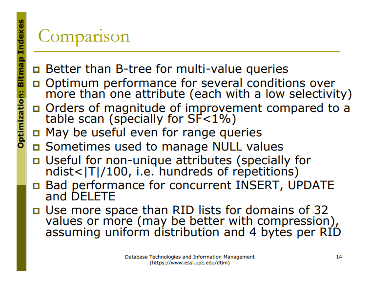

## Optimization: Bitmap Indexes
L'estructura del BitTree dependrà de la query que estem tractant d'optimizar, mentre que el Bitmap serà flexible a qualsevol query.
 - Exemple: Si tinc un BitTree que implementa `Model + Year`, em servirà per fer queries de només `MOdel`, però no em servirà per fer queries de només `Year`. Order matters.

Els bitTrees són útils per implementar les primary keys, i així poder fer cerques dicotòmiques en temps logarítmic. 

Per valors categòrics (i per multi-value queries actually), molt millor implementar un Bitmap abans que un BitTree per 
> OJU: You should not create a Bitmap for an attribute where you will have more indices than rows (never do it for primary keys).

Si tinc quatre categories per `region`, la implementació tindra` un bitvector associat a cada categoria:
```
region = [
    'Catalunya':    '01000100010...'
    'Leon':         '00100000100...'
    'Madird':       '10001010001...'
    'Andalucia':    '00010001000...
]
```
Aclaració de una diapo:


ELs nostres bitvectors es composaran de diferents blocks, cadascun amb la capacitat d'enmagatzemar una quantitat `bits` the bits.

SF = probability of a tuple fullfilling the queried property (serendipity factor)
T = rows in my table
D = time it takes to load one block
B = number of blocks in my table





## Bitmap Compression
Una estratègia de compressió podria ser codificar 1s o 0s repetits: 11111 -> 101 (5 en binari)

21 =  10101
33 = 100001

 11110|10101
111110|100001